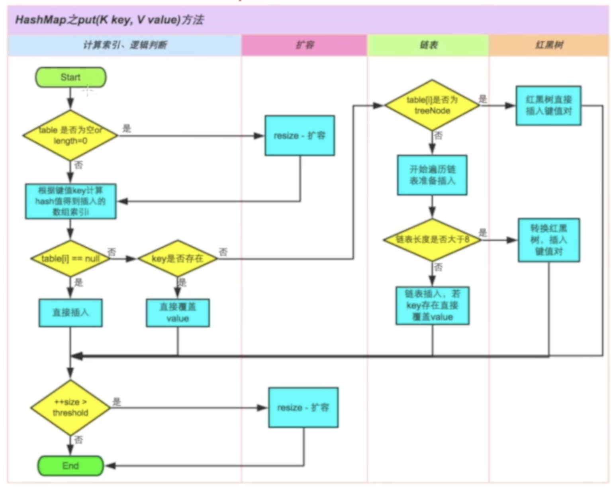

# 目录

[TOC]

# 内容

## 一. HashMap

### 1.1 参考资料

（1）B站“寒食君”解读源码：https://www.bilibili.com/video/BV14z4y1d7Wa?spm_id_from=333.788.b_636f6d6d656e74.9

### 1.2 阅读源码

#### 1.2.1 成员变量

```java
/* ---------------- 定义final常量 -------------- */
static final int DEFAULT_INITIAL_CAPACITY = 1 << 4;  // 数组默认初始长度为16，初始值必须为2^n

static final int MAXIMUM_CAPACITY = 1 << 30;  // 数组最大长度为2^30

static final float DEFAULT_LOAD_FACTOR = 0.75f;  // 负载因子为0.75

static final int TREEIFY_THRESHOLD = 8;  // 当链表上的节点数量大于8时，链表

static final int UNTREEIFY_THRESHOLD = 6;  // 

static final int MIN_TREEIFY_CAPACITY = 64;  // 


/* ---------------- 定义Node内部类 -------------- */
// Node就是数组中存放的一个一个的元素
// Map.Entry<K, V>是一个接口，Node是他的实现类
static class Node<K,V> implements Map.Entry<K,V> {
        final int hash;  // 记录hash值
        final K key;  // 要存入的key
        V value;  // 要存入的value
        Node<K,V> next;  // next指向Node的下一个节点

        Node(int hash, K key, V value, Node<K,V> next) {  // Node类的构造函数
            this.hash = hash;
            this.key = key;
            this.value = value;
            this.next = next;
        }

        public final K getKey()        { return key; }
        public final V getValue()      { return value; }
        public final String toString() { return key + "=" + value; }
  
				// 重写了hashCode方法
        public final int hashCode() {  // 计算HashCode，将 key的hash值 和 value的hash值 做 异或 运算
            return Objects.hashCode(key) ^ Objects.hashCode(value);
        }

        public final V setValue(V newValue) {  // 设置新的newValue，同时返回oldValue
            V oldValue = value;
            value = newValue;
            return oldValue;
        }
  
				// 重写了equals方法
        public final boolean equals(Object o) {
            if (o == this)
                return true;
            if (o instanceof Map.Entry) {
                Map.Entry<?,?> e = (Map.Entry<?,?>)o;
                if (Objects.equals(key, e.getKey()) &&
                    Objects.equals(value, e.getValue()))
                    return true;
            }
            return false;
        }
    }


/* ---------------- 定义成员变量 -------------- */
transient Node<K,V>[] table;  // 数组table，其中存放的是Node<K,V>

transient Set<Map.Entry<K,V>> entrySet;  // 存放Map中的所有Entry，便于用来遍历等操作

transient int size;  // table中被使用的实际元素的数量

transient int modCount;  // 计数器，记录hashMap结构发生变化的次数，比如put了一个新的key、发生了扩容等等

int threshold;  // threshold = size * loadFactor

final float loadFactor;  // 负载因子，默认为0.75
```

> 注：
>
> （1）为什么链表转化为红黑树的临界值设置为8？答：和泊松分布有关，是空间开销和时间开销的取舍。
>
> （2）为什么负载因子默认为0.75？答：和泊松分布有关，其他因素相同时，负载因子等于0.75时hash碰撞次数最少。


> 补充知识点：
>
> （1）java中static修饰的变量的作用：https://blog.csdn.net/longzhoufeng/article/details/89883393
>
> （2）Java泛型中E、T、K、V等的含义：https://blog.csdn.net/chenlycly/article/details/25561029
>
> （3）Java中&，|，^，之间的区别：https://blog.csdn.net/l8947943/article/details/103920279
>
> （4）transient修饰符：https://www.cnblogs.com/hoojjack/p/6881977.html
>
> （5）什么是序列化/反序列化？：https://www.jianshu.com/p/89c2a19772e2

#### 1.2.2 HashMap的扩容机制

```java
// 计算key的hash值
static final int hash(Object key) {
  	int h;
  	return (key == null) ? 0 : (h = key.hashCode()) ^ (h >>> 16);
}
```

> 注：
>
> （1）HashMap什么时候会扩容？答：当数组中的元素被使用到了75%也就是数组长度大于等于16 * 0.75 = 12（即为threshold）时候便会扩容。
>
> （2）HashMap每次扩容多少？答：扩容2^n 倍。
>
> （3）HashMap扩容的优缺点？答：优点是可以给数组扩展更多的空间，同时能减少hash冲突的概率；缺点是扩容比较耗费计算机资源、降低性能。
>
> （4）为什么数组table的初始长度为2^n，同时扩容的时候也是扩容2^n？答：在取模的时候做优化。当put元素时，判断一个元素进入哪一个桶的时候，需要对元素的hash值取模，但是取模是一个比较重、比较耗性能的操作，而当数组的长度len为2^n的时候，hash值对length取模==hash值 & (length - 1)，位与操作的性能更好（因为位与运算是位运算，是直接对二进制计算的）。
>
> （5）为什么当数组的长度为2^n的时候，hash值 % length==hash值 & (length - 1) 恒成立？答：对无符号数的取模和取余是一样的，<font color='red'>TODO</font>
>
> （6）在上述的static final int hash(Object key)中，计算key的hash值时，有一个操作为v，为什么要先右移16位，再做异或运算呢？答：在扩容时，resize的时候，将oldTable中元素 添加到newTable中时，使用了该操作：`newTab[e.hash & (newCap - 1)] = e;
>
> ```java
>  final Node<K,V>[] resize() {
>    ......
>  
>    Node<K,V> e;
>                   if ((e = oldTab[j]) != null) {
>                       oldTab[j] = null;
>                       if (e.next == null)
>                           newTab[e.hash & (newCap - 1)] = e;
>                    }
>    ......
>  }
> ```
>
> （7）为什么要做这两种操作？`(h = key.hashCode()) ^ (h >>> 16)`答：主要是为了保留高位和低位的信息，信息混合，减少碰撞

#### 1.2.3 HashMap的构造函数

```java
/* ---------------- 构造函数 -------------- */
public HashMap(int initialCapacity, float loadFactor) {
    if (initialCapacity < 0)
        throw new IllegalArgumentException("Illegal initial capacity: " +
                                           initialCapacity);
    if (initialCapacity > MAXIMUM_CAPACITY)
        initialCapacity = MAXIMUM_CAPACITY;
    if (loadFactor <= 0 || Float.isNaN(loadFactor))
        throw new IllegalArgumentException("Illegal load factor: " +
                                           loadFactor);
    this.loadFactor = loadFactor;
    this.threshold = tableSizeFor(initialCapacity);
}

public HashMap(int initialCapacity) {
		this(initialCapacity, DEFAULT_LOAD_FACTOR);
}

public HashMap() {
    this.loadFactor = DEFAULT_LOAD_FACTOR; // all other fields defaulted
}

public HashMap(Map<? extends K, ? extends V> m) {
    this.loadFactor = DEFAULT_LOAD_FACTOR;
  	putMapEntries(m, false);
}
```

#### 1.2.4 HashMap put元素的流程

```java
public V put(K key, V value) {
  	return putVal(hash(key), key, value, false, true);
}

final V putVal(int hash, K key, V value, boolean onlyIfAbsent, boolean evict) {
  // 设置几个局部变量
    Node<K,V>[] tab; Node<K,V> p; int n, i;
  // 如果 table==null 或者 table.length==0，扩容
    if ((tab = table) == null || (n = tab.length) == 0)
      n = (tab = resize()).length;
  // 计算key的hash值得到插入的数组索引i
  // table[i]==null，直接插入
    if ((p = tab[i = (n - 1) & hash]) == null)
      tab[i] = newNode(hash, key, value, null);
  // table[i] != null，要去看一下key是否存在
    else {
      Node<K,V> e; K k;
      // p.hash == hash说明key已经存在
      if (p.hash == hash && ((k = p.key) == key || (key != null && key.equals(k))))
        e = p;
      else if (p instanceof TreeNode)
        e = ((TreeNode<K,V>)p).putTreeVal(this, tab, hash, key, value);
      else {
        for (int binCount = 0; ; ++binCount) {
          if ((e = p.next) == null) {
            p.next = newNode(hash, key, value, null);
            if (binCount >= TREEIFY_THRESHOLD - 1) // -1 for 1st
              treeifyBin(tab, hash);
            break;
          }
          if (e.hash == hash &&
              ((k = e.key) == key || (key != null && key.equals(k))))
            break;
          p = e;
        }
      }
      if (e != null) { // existing mapping for key
        V oldValue = e.value;
        if (!onlyIfAbsent || oldValue == null)
          e.value = value;
        afterNodeAccess(e);
        return oldValue;
      }
    }
    ++modCount;
    if (++size > threshold)
      resize();
    afterNodeInsertion(evict);
    return null;
}
```



## 二. xx

## 三. xx

## 八. 零碎知识点

### 8.1 集合的线程安全性

https://zhuanlan.zhihu.com/p/43652260