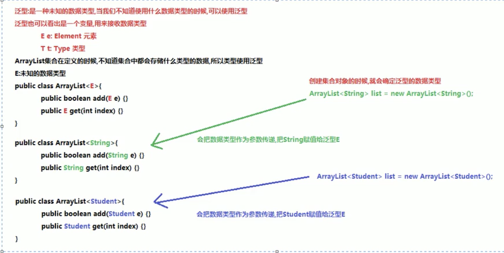
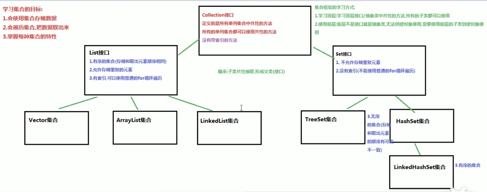
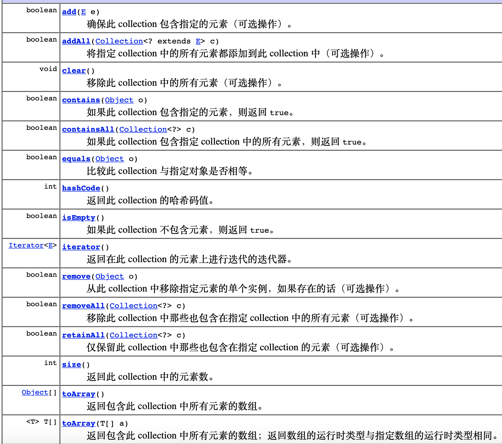
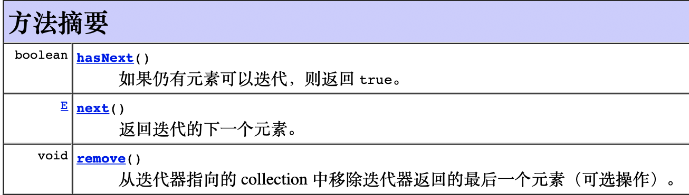

# 目录

[TOC]

# 内容

## 一. 反射

### 1. 反射的概念

**反射**：将类的各个组成部分封装为其他对象，这就是反射机制。


### 2. 反射的优点

- 可以在程序运行过程中，操作这些对象
- 可以解耦，来提高程序的可扩展性

### 3. 获取Class对象的方式

- Source源代码阶段：Class.forName("全类名")：将字节码文件加载进内存，返回class对象

  ​								*多用于配置文件，将类名定义在配置文件中。读取文件，加载类*。

- Class类对象阶段：类名.class：通过类名的属性class来获取

  ​								*多用于参数的传递*。

- Runtime运行时阶段：对象.getClass()：getClass()在Object类中定义的

  ​								*多用于对象的获取字节码的方式*。

代码举例：

```java
 package reflect;

import domain.Person;
import domain.Student;

public class RelectDemo1 {
    /*
    获取Class对象的方式：
    - Source源代码阶段：Class.forName("全类名")：将字节码文件加载进内存，返回class对象
    - Class类对象阶段：类名.class：通过类名的属性class来获取
    - Runtime运行时阶段：对象.getClass()：getClass()在Object类中定义的
     */

    public static void main(String[] args) throws ClassNotFoundException {
        // - Source源代码阶段：Class.forName("全类名")：将字节码文件加载进内存，返回class对象
        Class cls1 = Class.forName("domain.Person");
        System.out.println(cls1);

        // - Class类对象阶段：类名.class：通过类名的属性class来获取
        Class cls2 = Person.class;
        System.out.println(cls2);

        // - Runtime运行时阶段：对象.getClass()：getClass()在Object类中定义的
        Person person = new Person();
        Class cls3 = person.getClass();
        System.out.println(cls3);

        // == 比较三个对象
        System.out.println(cls1 == cls2);  // true
        System.out.println(cls2 == cls3);  // true
        System.out.println(cls1 == cls3);  // true
        
        // Sutdent的字节码文件对象
        Class c = Student.class;
        System.out.println(c == cls1);  // false
    }
}
```

**注意**：同一个字节码文件（.class文件）在一次程序运行过程中，只会被加载一次，不论通过哪一种方式获取的Class对象都是同一个。

### 4. Class对象的功能

#### 4.1 获取功能

- 获取成员变量们

  `Field[] getFields()  // 获取所有public修饰的成员变量`  

  `Field getField(String name)  // 获取指定名称的public修饰的变量`

  

  `Field[] getDeclaredFields()  // 获取所有的成员变量，不考虑修饰符`

  `Field getDeclaredField(String`name)  // 获取指定名称的变量，不考虑修饰符 `

  在使用此函数getDeclaredField时，遇到get非public的成员变量时，需要**忽略访问权限修饰符的安全检查（暴力反射）**，代码如下所示：

  `field.setAccessible(true);  // 暴力反射`

  对于Field而言:

  - 设置值

    `void set(Object obj, Object value)`

  - 获取值

    `get(Object obj)`

  - 忽略访问权限修饰符的安全检查（暴力反射）

    `field.setAccessible(true); `

- 获取构造方法们

  `Constructor<?>[] getConstructors()`

  `Constructor<T> getConstructor(类<?>...parameterTypes)`

  

  `Constructor<?>[] getDeclaredConstructors()`

  `Constructor<T> getDeclaredConstructor(类<?>...parameterTypes)`

- 获取成员方法们

  `Method[] getMethods()`

  `Method getMethod(String name, 类<?>..parameterTypes)`

  

  `Method[] getDeclaredMethods()`

  `Method getDeclaredMethod(String name, 类<?>..parameterTypes)`

- 获取类名

  String getName()

  <font color="red">未完待续</font>

  ---

## 二. Java多线程

### 2.1 并发和并行

并发：交替进行

并行：同时进行

### 2.2 volatile关键字

https://blog.csdn.net/u012723673/article/details/80682208

### 2.3 来自好兄弟的多线程资料的分享

https://blog.csdn.net/xiaokang123456kao/article/details/77331878?utm_medium=distribute.pc_relevant.none-task-blog-BlogCommendFromMachineLearnPai2-2.nonecase&depth_1-utm_source=distribute.pc_relevant.none-task-blog-BlogCommendFromMachineLearnPai2-2.nonecase


---

## 三. HashMap & HashTable & ConcurrentHashMap

### 3.1 HashMap和HashTable的区别

*参考链接：https://zhuanlan.zhihu.com/p/37607299*

（1）基本的区别

- HashMap是线程不安全的，在多线程环境下会容易产生死循环，但是单线程环境下运行效率高；Hashtable线程安全的，很多方法都有synchronized修饰，但同时因为加锁导致单线程环境下效率较低。

- HashMap允许有一个key为null，允许多个value为null；而Hashtable不允许key或者value为null。

（2）构造函数的比较

见https://zhuanlan.zhihu.com/p/37607299

- HashMap的底层数组的长度必须为2^n，这样做的好处是为以后的hash算法做准备。

- Hashtable底层数组的长度可以为任意值，这就造成了当底层数组长度为合数的时候，Hashtable的hash算法散射不均匀，容易产生hash冲突。所以，可以清楚的看到Hashtable的默认构造函数底层数组长度为11（质数）。

（3）Hash算法的比较

- HashMap的hash算法通过非常规的设计，将底层table长度设计为2^n（合数），这是HashMap的一处优化。
- Hashtable的hash算法首先使得hash的值小于等于整型数的最大值，再通过%运算实现均匀散射。

（4）扩容机制的区别

- HashMap数组的扩容的整体思想就是创建一个长度为原先2倍的数组。然后对原数组进行遍历和复制。只不过jdk1.8对扩容进行优化，使得扩容不再需要进行链表的反转，只需要知道hashcode新增的bit位为0还是1。如果是0就在原索引位置，新增索引是1就在oldIndex+oldCap位置
- Hashtable的扩容将先创建一个长度为原长度2倍的数组，再使用头插法将链表进行反序

（5）结构的区别

- HashMap在jdk1.8在原先的数组+链表的结构进行了优化，将实现结构变为数组+链表+红黑树。做这样的优化，是为了防止在一个哈希桶位置链表过长，影响get等方法的时间。基于HashMap为了防止链表过长影响get等方法的性能，在一条链表节点元素大于8的时候，会将链表封装成红黑树

- Hashtable到了jdk1.8了内部结构并没有实质优化，继续使用数组+链表的方式实现

### 3.2 HashMap在1.7和1.8中的区别

https://zhuanlan.zhihu.com/p/50675786

https://zhuanlan.zhihu.com/p/21673805

### 3.3 HashMap和ConcurrentHashMap的区别

https://zhuanlan.zhihu.com/p/50675786

### 3.4 阅读HashMap源码（jdk1.7）

### 3.5 阅读HashMap源码（jdk1.8）

https://www.bilibili.com/video/BV14z4y1d7Wa?spm_id_from=333.788.b_636f6d6d656e74.9

---

## 四. 泛型

### 4.1 泛型概述



### 4.2 使用泛型 & 不使用泛型的优缺点

**不使用泛型**

```java
/**
 * 创建集合对象，不使用泛型
 * 好处：
 *      集合不使用泛型，默认的类型就是Object类型，可以存储任意类型的数据
 * 弊端：
 *      不安全，会引发异常
 */
public static void show01() {
    ArrayList list = new ArrayList();
    list.add("abc");
    list.add(1);
    System.out.println(list);  ////
    // 使用迭代器遍历list集合
    Iterator it = list.iterator();
    while(it.hasNext()) {
        // 取出元素也是Object类型
        Object val = it.next();
        System.out.println(val);

        // 想要使用String类特有的方法length()获取字符串的长度
        // 需要向下转型，才能使用String类特有的方法
        String s = (String) val;  // 会抛出ClassCastException异常，异常转换异常
        System.out.println(s);

    }
}
```

**使用泛型**

````java
/**
 * 创建集合对象，使用泛型
 * 好处：
 *      1.避免了类型转换的麻烦，存储的是什么类型，取出的就是什么类型
 *      2.把运行期异常（代码运行之后会抛出异常），提升到了编译期（写代码的时候会报错）
 * 弊端：
 *      泛型是什么类型，只能存储什么类型的数据
 */
public static void show02() {
    ArrayList<String> list = new ArrayList<>();
    list.add("A");
    list.add("B");
    list.add(1);  // 编译报错
}
````

### 4.3 定义和使用含有泛型的类

**自定义含有泛型的类**

```java
/**
 * 定义一个含有泛型的类，模拟ArrayList集合
 * 泛型是一个未知的数据类型，当我们不确定什么数据类型的时候，可以使用泛型
 * 泛型可以接收任意的数据类型，可以使用Integer，String，Student....
 * 创建对象的时候确定泛型的数据类型
 */
public class MyGenericClass<E> {

    private E name;

    public E getName() {
        return name;
    }

    public void setName(E name) {
        this.name = name;
    }
}
```


**使用含有泛型的类**

```java
public static void main(String[] args) {
    // 不使用泛型默认为Object类型
    MyGenericClass mgc = new MyGenericClass();

    // 使用泛型
    MyGenericClass<Integer> mgc1 = new MyGenericClass<>();
    mgc1.setName(1);
    Integer name1 = mgc1.getName();
    System.out.println(name1);

    // 使用泛型
    MyGenericClass<String> mgc2 = new MyGenericClass<>();
    mgc2.setName("ABC");
    String name2 = mgc2.getName();
    System.out.println(name2);
}
```

### 4.4 定义和使用含有泛型的方法

**定义含有泛型的方法**

```java
/**
 * 定义含有泛型的方法：泛型定义在方法的修饰符和返回值类型之间
 *
 * 格式:
 *      修饰符 <泛型> 返回值类型 方法名(参数列表(使用泛型)) {
 *          方法体
 *      }
 * 含有泛型的方法，在调用方法的时候确定泛型的数据类型，传递什么类型的参数，泛型就是什么类型
 *
 */
public class MyGenericMethod {
    // 定义一个含有泛型的方法
    public <M> void method01(M m) {
        System.out.println(m);
    }

    // 定义一个含有泛型的静态方法
    public static <S> void method02(S s) {
        System.out.println(s);
    }
}
```


**使用含有泛型的方法**

```java
public static void main(String[] args) {
    // 创建MyGenericMethod对象
    MyGenericMethod mgm = new MyGenericMethod();

    /**
     * 调用含有泛型的方法method01
     * 传递什么类型，泛型就是什么类型
     */
    mgm.method01(10);
    mgm.method01("ABC");
    mgm.method01(8.88);
    mgm.method01(true);

    /**
     * 调用含有泛型的方法method02
     * 传递什么类型，泛型就是什么类型
     */
    MyGenericMethod.method02(10);
    MyGenericMethod.method02("ABC");
    MyGenericMethod.method02(8.88);
    MyGenericMethod.method02(true);

}
```

### 4.5 定义和使用含有泛型的接口

**定义含有泛型的接口**

```java
/**
 * 定义含有泛型的接口
 */
public interface MyGenericInterface<I> {
    public abstract void method(I i);
}
```


**定义含有泛型的接口实现类方式一**

```java
/**
 * 含有泛型的接口，第一种使用方式：定义接口的实现类，实现接口，指定接口的泛型
 */
public class MyGenericInterfaceImpl1 implements MyGenericInterface<String>{

    @Override
    public void method(String s) {
        System.out.println(s);
    }
}
```


**定义含有泛型的接口实现类方式二**

```java
/**
 * 含有泛型的接口，第二种使用方式：接口使用什么泛型，实现类就使用什么泛型，类跟着接口走
 * 相当于定义了一个含有泛型的类，创建对象的时候指定泛型
 */
public class MyGenericInterfaceImpl2<I> implements MyGenericInterface<I>{
    @Override
    public void method(I i) {
        System.out.println(i);
    }
}
```


**使用含有泛型的接口**

```java
/**
 * 测试含有泛型的接口
 */
public class Main {
    public static void main(String[] args) {
        // 测试第一种接口使用方式
        MyGenericInterfaceImpl1 mgi1 = new MyGenericInterfaceImpl1();
        mgi1.method("ABC");

        // 测试第二种接口使用方式
        MyGenericInterfaceImpl2<Integer> mgi2 = new MyGenericInterfaceImpl2<>();
        mgi2.method(1);
    }
}
```

### 4.6 泛型通配符

**使用场景**

不知道使用什么类型来接收的时候，此时可以使用?，?表示未知通配符。区别于E、I等，?不需要定义，可以直接使用。此时只能接收数据，而不能往集合中存储数据。

**通配符的使用-简单使用**

```java
/**
 * 泛型通配符：
 *      ?表示任意的数据类型
 * 使用方法：
 *      不能创建对象使用
 *      只能作为方法的参数使用
 */
public class Main {
    public static void main(String[] args) {
        ArrayList<Integer> list01 = new ArrayList<>();
        list01.add(1);
        list01.add(2);
        list01.add(3);

        ArrayList<String> list02 = new ArrayList<>();
        list02.add("A");
        list02.add("B");
        list02.add("C");

        printArray(list01);
        printArray(list02);

        // 注意：在定义集合的时候不能使用通配符
        // ArrayList<?> list03 = new ArrayList<?>();
    }

    /**
     * 定义一个方法，能遍历所有类型的ArrayList集合
     * 这时候我们不知道ArrayList集合使用什么数据类型，可以使用泛型的通配符?来接收数据类型
     * 注意：
     *      泛型没有继承概念的
     */
    public static void printArray(ArrayList<?> list) {
        // 使用迭代器遍历集合
        Iterator<?> it = list.iterator();
        while(it.hasNext()) {
            // it.next()方法，取出的元素是Object，可以接收任意的数据类型
            Object o = it.next();
            System.out.println(o);
        }
    }
}
```

**统配符的使用-高级使用（受限泛型）**

泛型的上限：

- 格式：`类型名称 <? extends 类> 对象名称`
- 意义：`只能接收该类型及其子类型`

泛型的下限：

- 格式：`类型名称 <? super 类> 对象名称`
- 意义：`只能接收该类型及其父类型`

```java
/**
 * 泛型的上限限定：? extends E  代表使用的泛型只能是E类型的子类或它本身
 * 泛型的下限限定：? super E  代表使用的泛型只能是E类型的父类或它本身
 */
public class Demo06GenericGeneral {
    public static void main(String[] args) {
        Collection<Integer> list1 = new ArrayList<>();
        Collection<String> list2 = new ArrayList<>();
        Collection<Number> list3 = new ArrayList<>();
        Collection<Object> list4 = new ArrayList<>();

        getElement1(list1);
        getElement1(list2);  // 报错
        getElement1(list3);
        getElement1(list4);  // 报错

        getElement2(list1);  // 报错
        getElement2(list2);  // 报错
        getElement2(list3);
        getElement2(list4);

        /**
         * 类与类之间的继承关系
         * Integer extends Number extends Object
         * String extends Object
         */
    }

    // 泛型的上限：此时的泛型?，必须是Number类型或者Number类型的子类
    public static void getElement1(Collection<? extends Number> coll) {}
    // 泛型的下限：此时的泛型?，必须是Number类型或者Number类型的父类
    public static void getElement2(Collection<? super Number> coll) {}
}
```


## 五. 一些零碎知识点

### 5.1 ==和equals的区别

https://zhuanlan.zhihu.com/p/78395057

（1）对于==而言

基本数据类型：比较的是值

引用数据类型：比较的是两个对象的地址值

（2）对于equals而言

Object.equals的源码：

```java
    public boolean equals(Object obj) {
        return (this == obj);
    }
```

equals没有被重写：相当于==，比较的是两个对象的地址值

equals被重写：自定义比较方法即可

equals重写示例：

```java
public class Person {

    private String name;
    private int age;

    @Override
    public boolean equals(Object obj) {
        // 增加一个判断，传递的参数obj如果是this本身，直接返回true，提高程序效率
        if (obj == this) {
            return true;
        }
        // 增加一个判断，传递的参数obj如果是null，直接返回false，提高程序效率
        if (obj == null) {
            return false;
        }
        // 增加一个判断，防止类型转换异常
        if (obj instanceof Person) {
            // 使用向下转型，把obj转换为Person类型
            Person p = (Person) obj;
            // 比较两个对象的属性，一个对象是this(person1)，一个对象是p（obj->person2）
            return this.name.equals(p.name) && this.age == p.age;
        }
        // 不是Person类型，直接返回false
        return false;
    }
}
```


### 5.2 equals和hashCode()的关系

## 六.集合

### 6.1 概述



### 6.2 Collection接口

**包名**

java.util.Collection

**使用方法**

```java
Collection<Integer> coll = new LinkedList<>();  // 多态形式
```

**常用方法**

Collection接口中的常用方法：



### 6.3 Iterator接口

**包名**

java.util.Iterator

**使用方法**

```java
// 创建一个集合对象
Collection<String> coll = new ArrayList<>();
// 在集合中添加元素
coll.add("A");
coll.add("B");
coll.add("C");
// Iterator<E>接口也是有泛型的，迭代器的泛型和集合的泛型一致
Iterator<String> it = coll.iterator();  // 多态
while(it.hasNext()) {
  String item = it.next();
  System.out.println(item);
}
```

**常用方法** 



### 6.4 红黑树

https://www.cnblogs.com/skywang12345/p/3245399.html


