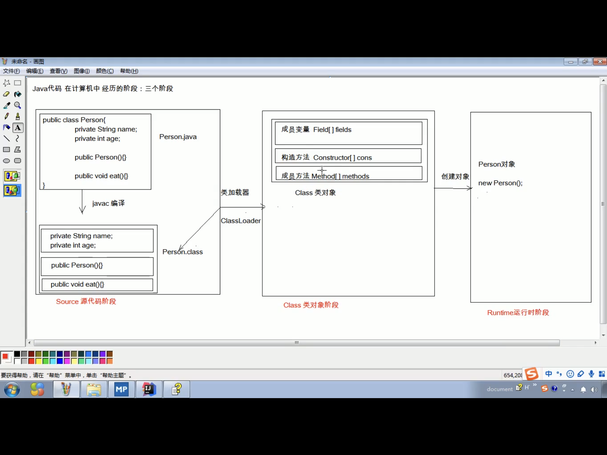

# 目录

[TOC]

# 内容

## 一. 反射

### 1. 反射的概念

**反射**：将类的各个组成部分封装为其他对象，这就是反射机制。



### 2. 反射的优点

- 可以在程序运行过程中，操作这些对象
- 可以解耦，来提高程序的可扩展性

### 3. 获取Class对象的方式

- Source源代码阶段：Class.forName("全类名")：将字节码文件加载进内存，返回class对象

  ​								*多用于配置文件，将类名定义在配置文件中。读取文件，加载类*。

- Class类对象阶段：类名.class：通过类名的属性class来获取

  ​								*多用于参数的传递*。

- Runtime运行时阶段：对象.getClass()：getClass()在Object类中定义的

  ​								*多用于对象的获取字节码的方式*。

代码举例：

```java
 package reflect;

import domain.Person;
import domain.Student;

public class RelectDemo1 {
    /*
    获取Class对象的方式：
    - Source源代码阶段：Class.forName("全类名")：将字节码文件加载进内存，返回class对象
    - Class类对象阶段：类名.class：通过类名的属性class来获取
    - Runtime运行时阶段：对象.getClass()：getClass()在Object类中定义的
     */

    public static void main(String[] args) throws ClassNotFoundException {
        // - Source源代码阶段：Class.forName("全类名")：将字节码文件加载进内存，返回class对象
        Class cls1 = Class.forName("domain.Person");
        System.out.println(cls1);

        // - Class类对象阶段：类名.class：通过类名的属性class来获取
        Class cls2 = Person.class;
        System.out.println(cls2);

        // - Runtime运行时阶段：对象.getClass()：getClass()在Object类中定义的
        Person person = new Person();
        Class cls3 = person.getClass();
        System.out.println(cls3);

        // == 比较三个对象
        System.out.println(cls1 == cls2);  // true
        System.out.println(cls2 == cls3);  // true
        System.out.println(cls1 == cls3);  // true
        
        // Sutdent的字节码文件对象
        Class c = Student.class;
        System.out.println(c == cls1);  // false
    }
}
```

**注意**：同一个字节码文件（.class文件）在一次程序运行过程中，只会被加载一次，不论通过哪一种方式获取的Class对象都是同一个。

### 4. Class对象的功能

#### 4.1 获取功能

- 获取成员变量们

  `Field[] getFields()  // 获取所有public修饰的成员变量`  

  `Field getField(String name)  // 获取指定名称的public修饰的变量`

  

  `Field[] getDeclaredFields()  // 获取所有的成员变量，不考虑修饰符`

  `Field getDeclaredField(String`name)  // 获取指定名称的变量，不考虑修饰符 `

  在使用此函数getDeclaredField时，遇到get非public的成员变量时，需要**忽略访问权限修饰符的安全检查（暴力反射）**，代码如下所示：

  `field.setAccessible(true);  // 暴力反射`

  对于Field而言:

  - 设置值

    `void set(Object obj, Object value)`

  - 获取值

    `get(Object obj)`

  - 忽略访问权限修饰符的安全检查（暴力反射）

    `field.setAccessible(true); `

- 获取构造方法们

  `Constructor<?>[] getConstructors()`

  `Constructor<T> getConstructor(类<?>...parameterTypes)`

  

  `Constructor<?>[] getDeclaredConstructors()`

  `Constructor<T> getDeclaredConstructor(类<?>...parameterTypes)`

- 获取成员方法们

  `Method[] getMethods()`

  `Method getMethod(String name, 类<?>..parameterTypes)`

  

  `Method[] getDeclaredMethods()`

  `Method getDeclaredMethod(String name, 类<?>..parameterTypes)`

- 获取类名

  String getName()

  <font color="red">未完待续</font>

  ---

## 二. Java多线程

### 2.1 并发和并行

并发：交替进行

并行：同时进行

### 2.2 volatile关键字

https://blog.csdn.net/u012723673/article/details/80682208

2.3 来自好兄弟的多线程资料的分享

https://blog.csdn.net/xiaokang123456kao/article/details/77331878?utm_medium=distribute.pc_relevant.none-task-blog-BlogCommendFromMachineLearnPai2-2.nonecase&depth_1-utm_source=distribute.pc_relevant.none-task-blog-BlogCommendFromMachineLearnPai2-2.nonecase


---

## 三. HashMap & HashTable & ConcurrentHashMap

### 3.1 HashMap和HashTable的区别

*参考链接：https://zhuanlan.zhihu.com/p/37607299*

（1）基本的区别

- HashMap是线程不安全的，在多线程环境下会容易产生死循环，但是单线程环境下运行效率高；Hashtable线程安全的，很多方法都有synchronized修饰，但同时因为加锁导致单线程环境下效率较低。

- HashMap允许有一个key为null，允许多个value为null；而Hashtable不允许key或者value为null。

（2）构造函数的比较

见https://zhuanlan.zhihu.com/p/37607299

- HashMap的底层数组的长度必须为2^n，这样做的好处是为以后的hash算法做准备。

- Hashtable底层数组的长度可以为任意值，这就造成了当底层数组长度为合数的时候，Hashtable的hash算法散射不均匀，容易产生hash冲突。所以，可以清楚的看到Hashtable的默认构造函数底层数组长度为11（质数）。

（3）Hash算法的比较

- HashMap的hash算法通过非常规的设计，将底层table长度设计为2^n（合数），这是HashMap的一处优化。
- Hashtable的hash算法首先使得hash的值小于等于整型数的最大值，再通过%运算实现均匀散射。

（4）扩容机制的区别

- HashMap数组的扩容的整体思想就是创建一个长度为原先2倍的数组。然后对原数组进行遍历和复制。只不过jdk1.8对扩容进行优化，使得扩容不再需要进行链表的反转，只需要知道hashcode新增的bit位为0还是1。如果是0就在原索引位置，新增索引是1就在oldIndex+oldCap位置
- Hashtable的扩容将先创建一个长度为原长度2倍的数组，再使用头插法将链表进行反序

（5）结构的区别

- HashMap在jdk1.8在原先的数组+链表的结构进行了优化，将实现结构变为数组+链表+红黑树。做这样的优化，是为了防止在一个哈希桶位置链表过长，影响get等方法的时间。基于HashMap为了防止链表过长影响get等方法的性能，在一条链表节点元素大于8的时候，会将链表封装成红黑树

- Hashtable到了jdk1.8了内部结构并没有实质优化，继续使用数组+链表的方式实现

### 3.2 HashMap在1.7和1.8中的区别

https://zhuanlan.zhihu.com/p/50675786

https://zhuanlan.zhihu.com/p/21673805

### 3.3 HashMap和ConcurrentHashMap的区别

https://zhuanlan.zhihu.com/p/50675786

### 3.4 阅读HashMap源码（jdk1.7）

### 3.5 阅读HashMap源码（jdk1.8）

---

## 四. 红黑树

https://www.cnblogs.com/skywang12345/p/3245399.html

## 五. 一些零碎知识点

### 5.1 ==和equals的区别

https://zhuanlan.zhihu.com/p/78395057


