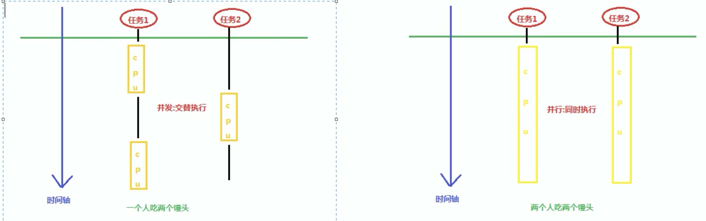
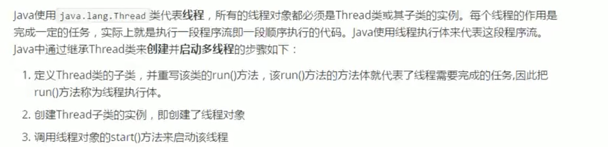
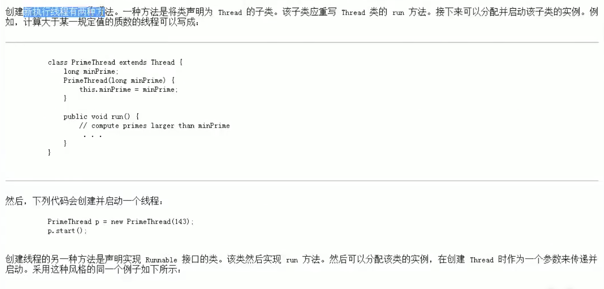
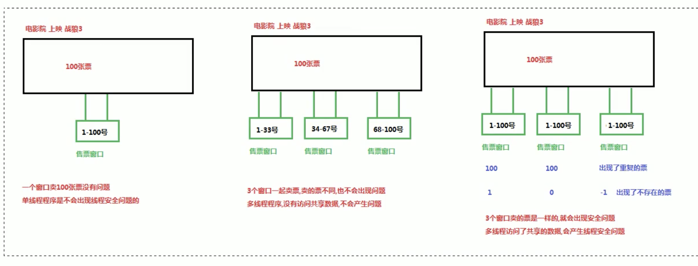
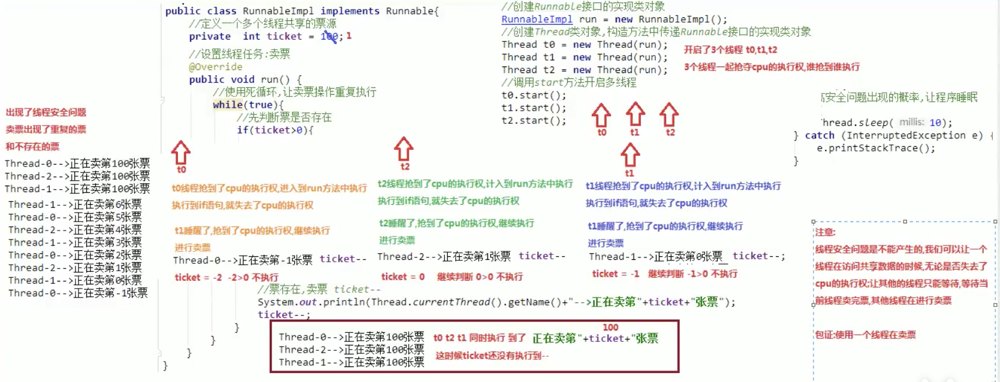
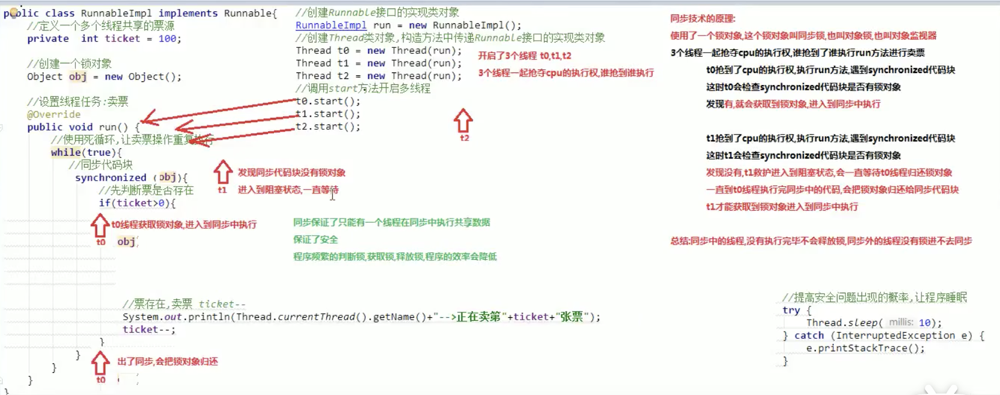
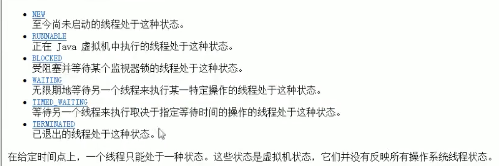
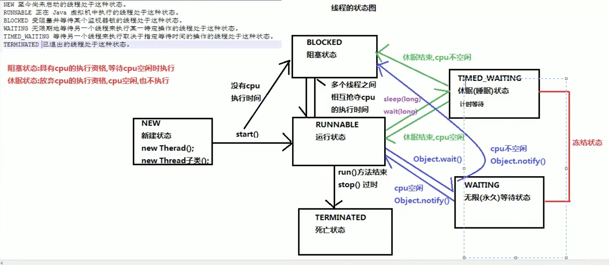
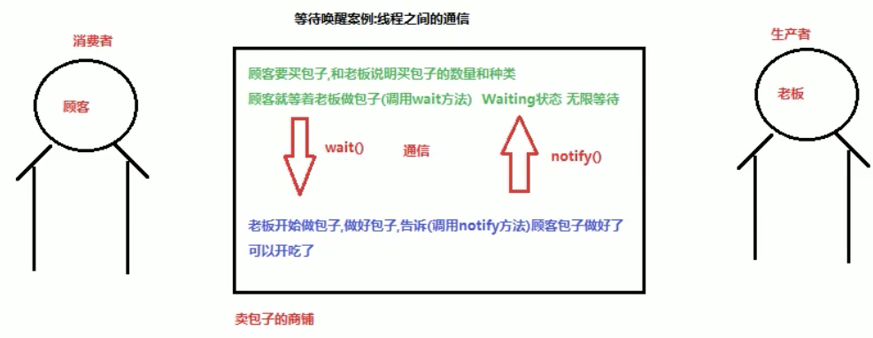

# 目录

[TOC]

# 内容

## 一. 并发和并行

- 并发：指两个或多个事件在同一个时间段内发生。（交替执行）
- 并行：指两个或多个事件在同一时刻发生。（同时执行）

## 二. 进程和线程

- 进程：进程是指一个内存中运行的应用程序，每个进程都有一个独立的内存空间，一个应用程序可以同时运行多个进程；进程也是程序的一次执行过程，是系统运行程序的基本单位；系统运行一个程序即是一个进程从创建、运行到消亡的过程。
- 线程：线程是进程中的一个执行单元，负责当前进程中程序的执行，一个进程中至少有一个线程。一个进程中是可以有多个线程的，这个应用程序也可以被称之为多线程程序。

### 2.1 进程概念

### 2.2 线程概念

### 2.3 线程调度

- 分时调度
- 抢占式调度

### 2.4 主线程

### 2.5  创建线程的第一种方式-Thread

#### 2.5.1 创建线程的第一种方式-Thread

#### 2.5.2 多线程的原理-随机性打印结果

#### 2.5.3 多线程内存图解

#### 2.5.4 Thread类的常用方法-获取线程名称

#### 2.5.5 Thread类的常用方法-设置线程名称

#### 2.5.6 Thread类的常用方法-sleep

### 2.6  创建线程的第二种方式-Runnable

### 2.7 Thread和Runnable的区别（Runnable方式的优点）

### 2.8 匿名内部类方式实现线程的创建

### 2.9 线程安全问题

#### 2.9.1 线程安全问题的代码实现

#### 2.9.2 线程安全问题产生的原理

#### 2.9.3 解决线程安全问题-*同步代码块*

#### 2.9.4 同步技术的原理

#### 2.9.5 解决线程安全问题-*同步方法*

#### 2.9.6 静态同步方法

#### 2.9.7 解决线程安全问题-*Lock锁*

### 2.10 线程状态

#### 2.10.1 等待唤醒案例分析

#### 2.10.2 等待唤醒案例代码实现

#### 2.10.3 Object类中wait带参方法和notifyAll()

#### 2.10.4 线程间通信

#### 2.10.5 等待唤醒机制概述（视频中的文字知识点较多）

#### 2.10.6 等待唤醒机制需求分析

#### 2.10.7 等待唤醒机制代码实现_包子类&包子铺类

### 2.10.8 等待唤醒机制代码实现_吃货类&测试类

### 2.11 线程池的概念和原理

#### 2.11.1 线程池的概念和原理

- 线程池的原理

- 线程池的好处

#### 2.11.2 线程池的代码实现

